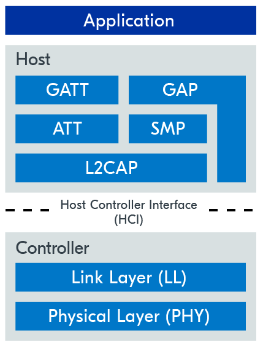

# BLE

### What is Bluetooth Low Energy?

Bluetooth Low Energy (BLE) is a wireless communication technology for short-range communication. It is similar to Wi-Fi in the sense that it allows devices to communicate with each other, but it is meant for situations where battery life is preferred over high data transfer speeds.

### Bluetooth LE features

Bluetooth LE, as its name implies, focuses on achieving low energy consumption by sacrificing data rate.

* Data packets are made smaller, ranging from 27 to 251 bytes
* Data is being sent as seldom as possible to avoid long radio-on times

This makes Bluetooth LE more suitable for battery-operated devices that need to operate on minimal power and only send small bursts of data.

| Operating band                                       | 
2400 MHz – 2483.5 MHz ~ 2.4 GHz
 |
| ---------------------------------------------------- | ----------------------------------------- |
| Channel bandwidth                                    | 2 MHz                                     |
| Number of RF channels                                | 40                                        |
| Maximum transmit power                               | 
20 dBm 0.1 W
                    |
| Maximum application data throughput                  | 1.4 Mbps                                  |
| Maximum range at reduced data rates (125 & 500 kbps) | \~1000 m                                  |


The range will always depend on several factors related to the software and hardware configuration of the devices used, as well as the specific environment where the devices operate. Therefore, it is complicated to have a generalized precise range estimate.


A key advantage of Bluetooth Low Energy is its low cost when compared to other low-power personal area networks, making it attractive for applications requiring mass deployments.

### Bluetooth LE protocol stack

<figure><figcaption>
The image depicts the protocol stack architecture, showing which layers make up the Bluetooth LE host and which make up the Bluetooth LE controller.
</figcaption></figure>

At the top, you have the application. This is the layer that the user interacts with, through APIs, to make use of the Bluetooth LE protocol.

### Host

The Bluetooth LE host consists of the following layers:

* **Logical Link Control & Adaptation Protocol (L2CAP)**: provides data encapsulation services to the upper layers.
* **Security Manager Protocol (SMP)**: defines and provides methods for secure communication.
* **Attribute Protocol (ATT)**: allows a device to expose certain pieces of data to another device.
* **Generic Attribute Profile (GATT)**: defines the necessary sub-procedures for using the ATT layer.
* **Generic Access Profile (GAP)**: interfaces directly with the application to handle device discovery and connection-related services.

### Controller

The Bluetooth LE controller is comprised of the following layers:

* **Physical Layer (PHY)**: determines how the actual data is modulated onto the radio waves, and how it is transmitted and received.
* **Link Layer (LL)**: manages the state of the radio, defined as one of the following – standby, advertising, scanning, initiating, connection.
