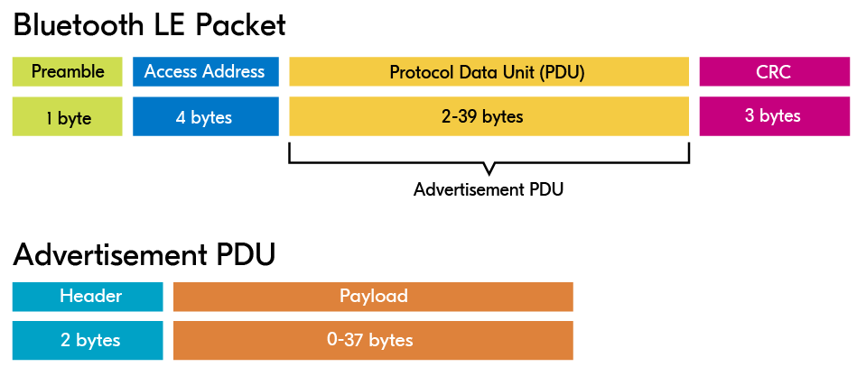
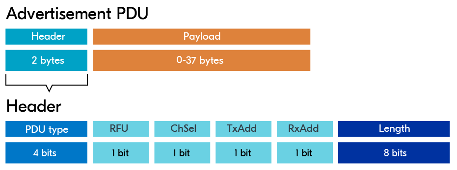
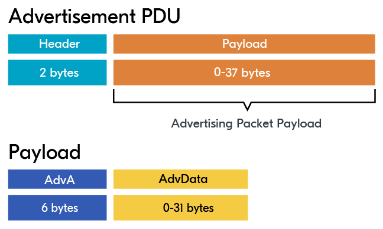
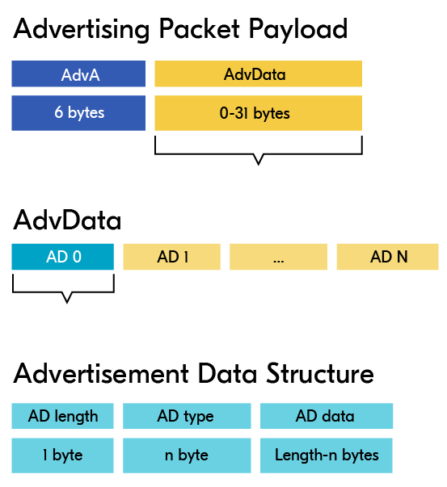

# Advertisement Packet

The BLE packet is pictured below, with the main portion going to what’s called the **Protocol Data Unit** (PDU).

**The PDU** consists of either an advertising PDU or a data PDU, depending on whether the BLE packet is used for advertisement or data transmission.

<figure><figcaption>
Bluetooth LE packet structure
</figcaption></figure>

As we can see in the image, the advertising PDU consists of a **header and a payload**.

The **header** part of the advertising PDU consists of:

<figure><figcaption>
Advertisement PDU header
</figcaption></figure>

* **PDU Type**: Determines the advertisement type.
* **RFU**: Reserved for future use.
* **ChSel**: Set to 1 if LE Channel Selection Algorithm #2 is supported.
* **TxAdd** (Tx Address): 0 or 1, depending on whether the transmitter address is public or random.
* **RxAdd** (Rx Address): 0 or 1, depending on whether the receiver address is public or random.
* **Length**: The length of the payload

The payload of the **advertising PDU** is divided into two sections, where the first 6 bytes represent the advertiser’s address (AdvA) and the rest goes to the actual advertisement data (AdvData).

<figure><figcaption>
Advertisement PDU payload
</figcaption></figure>

* **AdvA**: Bluetooth address of the advertising device
* **AdvData**: Advertisement data&#x20;


The payload structure depends on the kind of advertising. When doing directed advertisement some space is needed to also specify the receiver’s address. Therefore, the AdvData field is replaced by a receiver address field with a size of 6 bytes. Advertisement packets of this type do not include a payload.


The **advertisement data** section is represented as shown in the figure below.

<figure><figcaption>
Advertising packet payload
</figcaption></figure>

The advertisement data packet is composed of **multiple structures** called advertisement data structures (AD structures).

Each **AD structure** has a length field, a field to specify the type (AD Type), and a field for the actual data itself (AD Data).

Below are a few **commonly** used advertising data types:

* **Complete local name**: This is simply the device name, that the human user sees when scanning for nearby devices (via a smartphone, for instance).
* **Shortened local name**: A shorter version of the complete local name.
* **Uniform Resource Identifier**: Used to advertise a URI like website addresses (URLs).
* **Service UUID**: The Service Universally Unique Identifier is a number universally unique to a specific service. It can help scanners identify devices that are interesting to connect to. Different options are available here.
* **Manufacturer-Specific Data:** This is a popular type that enables companies to define their own custom advertising data, as in the case of iBeacon.
* **Flags**: 1-bit variables that can flag a certain property or operational mode of that device.

### Flags

The advertisement flags are **one-bit flags** encapsulated in one byte, meaning that there are up to 8 flags that can be set. We will take a look at some of the most commonly used flags:

* **BT\_LE\_AD\_LIMITED**: Sets LE Limited Discoverable Mode, used with connectable advertising to indicate to a central that the device is only available for a certain amount of time before the advertising times out
* **BT\_LE\_AD\_GENERAL**: Sets LE General Discoverable Mode, used in connectable advertising to indicate that advertising is available for a long period of time (timeout = 0).
* **BT\_LE\_AD\_NO\_BREDR**: Indicates that classic Bluetooth (BR/EDR) is not supported.

Both **BT\_LE\_AD\_LIMITED** & **BT\_LE\_AD\_GENERAL** are meant for a device in a peripheral role.
