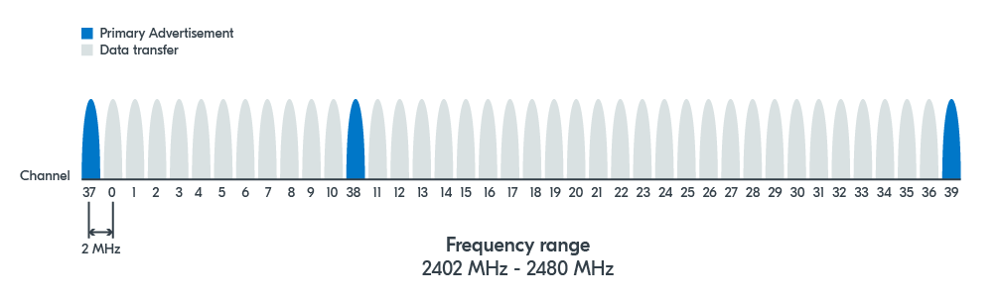
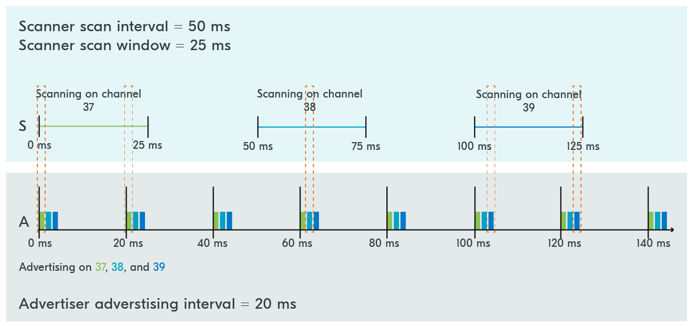
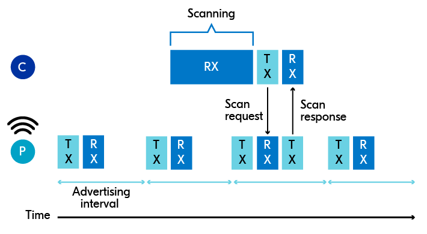

# Advertising Process

When a Bluetooth LE device is in an advertising state, it sends out **advertising packets** to announce its presence and potentially connect to another device. These advertising packets are sent out periodically at advertising intervals.

* **Advertising intervals:** The interval at which an advertising packet is sent. In the range of 20 ms to 10.24 s, with a step increase of 0.625 ms.

The smaller the advertising interval is, the **more frequently** the advertising packets are sent, and consequently, the more power is consumed.

Therefore, the **tradeoff** here is power consumption vs. how fast the advertiser’s advertisement packets will be received by a scanner, commonly referred to as discoverability.

To avoid packet collisions, a **random delay** of 0-10 ms is added before each advertisement packet. This ensures that devices with the same advertising interval do not end up with advertisement packet collisions all the time.

### Advertisement Channels

Bluetooth LE devices communicate through **40** different frequency channels.

These channels are **divided** into three primary advertisement channels and 37 secondary advertisement channels.

* **Primary advertisement channels:** mainly used for advertisement purposes.
* **Secondary advertisement channels:** can sometimes be used for advertisement purposes as well, but are mainly used for data transfer after establishing a connection.

<figure><figcaption>
Bluetooth channels
</figcaption></figure>

Advertising packets are sent on all **three primary** advertising channels, channels 37, 38, and 39. Simultaneously, a scanning device will scan these three channels to look for advertising devices.

Channels 37, 38, and 39, despite being consecutive numbers, are not actually neighboring channels. The separation between the three channels serves to **avoid adjacent-band interference**. Additionally, these three specific channels suffer the least from noise from other technologies using the ISM (_industrial, scientific, and medical)_ band, such as Wi-Fi.

### Scan Interval and Scan Window

Similar to an advertising interval, a scanning interval refers to **how often** a scanner will scan for advertisement packets.

The scan window refers to the time the scanner **spends scanning** for packets.

* **Scan interval:** The interval at which a device scans for advertisement packets.
* **Scan window:** The time that a device spends scanning for packets at each scan interval.


Both range from 2.5 ms to 10.24 seconds with a step increase of 0.625 ms.


Since a device advertises on three different advertisement channels, the scanner **will rotate** through the advertisement channels, by switching the channel after each scan interval.

<figure><figcaption>
Example of an advertiser (peripheral) and a scanner (central)
</figcaption></figure>

Short advertising intervals and scan intervals lead to **shorter discovery times** but increase power consumption.

A good practice is to set a relatively short scan interval with a longer advertising interval so that the scanning process is **more likely** to receive the advertising packets.

### Scan Request and Response

When a peripheral is advertising, a central can **also choose** to send a scan request to the peripheral, asking for additional information that is not included in the advertisement packets.

If the scan request is **accepted**, the peripheral will respond with what’s called a scan response, also transmitted over the three primary advertisement channels.

* **Scan request:** A message sent by a central device to a peripheral to request additional information not present in the advertisement packet.
* **Scan response:** A message sent as a response to a scan request, containing additional user data.

This is a way for the peripherals to send **additional data** without having to establish a connection with the central first.

The peripheral can alternatively choose to send back an **empty scan response** if it has no more additional information to provide.

<figure><figcaption>
Scan request example
</figcaption></figure>

Another way to increase the amount of data a peripheral can advertise at once is with a feature called **extended advertising**.

With this feature, the advertisement packets **broadcast** on the primary advertisement channels point to supplementary information that is being advertised on the secondary advertisement channels.
