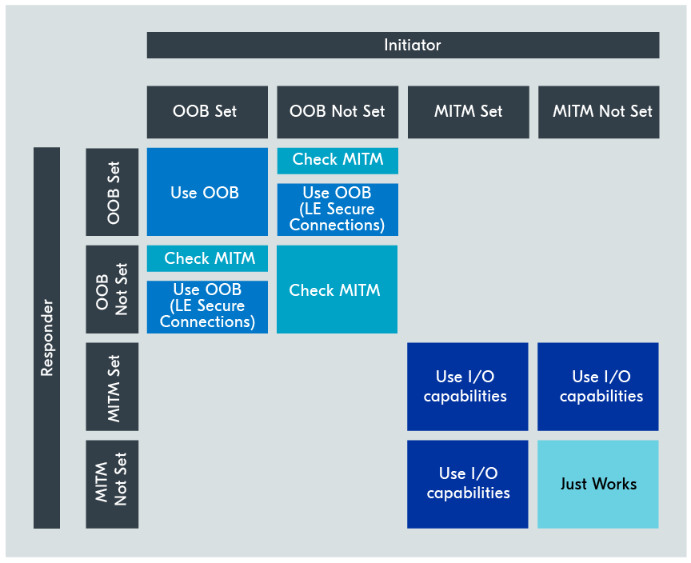
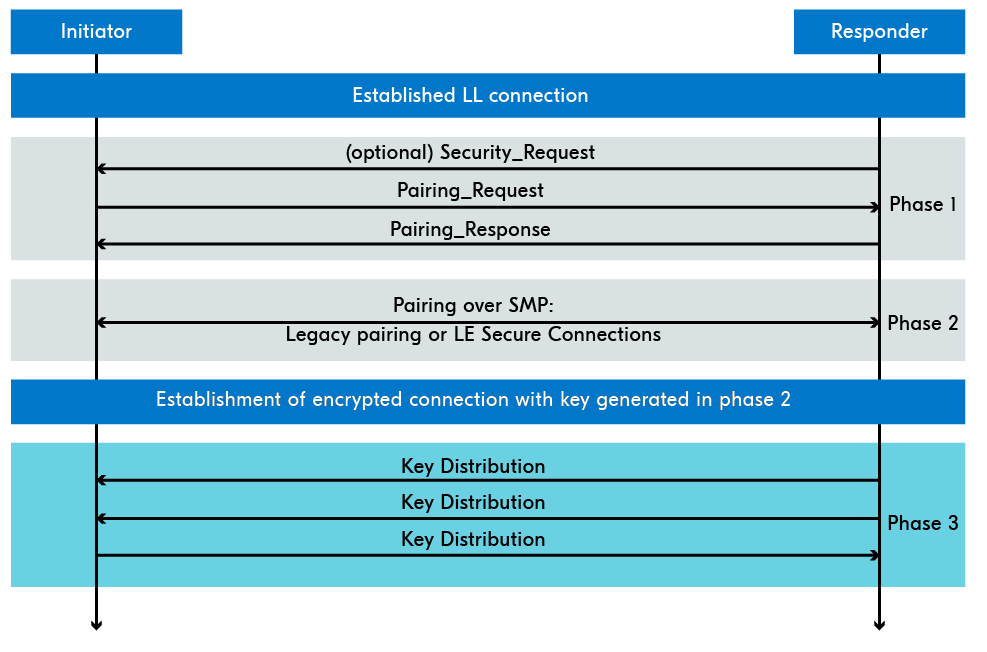

# Pairing Process

The **most common practice** of protecting wireless communication is to encrypt the connection, which converts the data being sent into a form that can only be read by those with the permission to do so.

To encrypt the link, both peers need to have the **same keys**. The process of generating, distributing, and authenticating these keys for encryption is referred to as the pairing process.

The pairing process requires the devices to **repeat the process** every time they want to encrypt the link again.

In addition to “pairing”, the term “bonding” is used when the **peers store** the encryption key so they can re-encrypt the link in future connections with the same peer.

During bonding, they can also exchange and store identity keys so they can **recognize each other** for future connections through the random resolvable private address.

* **Pairing**: The process of generating, distributing, and authenticating keys for encryption purposes.
* **Bonding:** The process of pairing followed by the distribution of keys used to encrypt the link in future reconnections.

**Bluetooth LE defines 3 phases in the encryption process.**

## Phase 1: Initiate Pairing

To initiate the pairing and, in some cases, the bonding process, the central needs to send a **Pairing Request**, and the peripheral responds with a Pairing Response.

In this phase, the two devices exchange their **pairing features**, which will be used to determine what pairing method they will use in Phase 2 and what keys will be distributed in Phase 3.

Most importantly, **the peers exchange** their I/O (input/output) capabilities, selected from one of the following:

* **DisplayOnly**: The peer only has a display
* **DisplayYesNo**: The peer has a display and the option to select “yes” or “no”
* **KeyboardOnly**: The peer has a keyboard only
* **NoInputNoOutput**: The peer has no input and no output capabilities
* **KeyboardDisplay**: The peer has keyboard and display capabilities

In addition, they exchange what **security features** they support, whether or not bonding is requested, and more.


Only the central can send a Pairing Request. The peripheral, however, can send a Security Request which can trigger a Pairing Request from the central, but it’s not a common practice.


## Phase 2: Perform pairing

In phase 2, the keys used to **encrypt the connection** are generated. The pairing method used here depends on the information exchanged in phase 1.

In LE Legacy pairing, the peers exchange a **Temporary Key** (TK) used to generate a Short Term Key (STK) that is then used to encrypt the link.

However, since the STK can easily be cracked, Bluetooth v4.2 introduced something called **Bluetooth LE Secure Connections**.

In LE Secure Connections, the devices generate and exchange a more secure type of key, and use it to generate a single **Long Term Key** (LTK) used to encrypt the connection.

Legacy pairing defines **three different methods** to exchange the TK, called pairing methods.

LE Secure Connections supports these **three pairing methods** but also a fourth (numeric comparison) that is not supported in Legacy pairing.

The security of the pairing process depends on **which pairing method** is used in this phase.

### Pairing Methods

* **Just Works**: Both peers generate the STK based on information exchanged in plain text, and the user is just asked to accept the connection. This method is unauthenticated.
* **Passkey Entry**: 6-digit number is displayed on one device, and needs to be typed in on the other device. The I/O capabilities of the devices determined which one displays the number and which one inputs it.
* **Out of Band (OOB)**: The encryption keys are exchanged by some other means than Bluetooth LE, for example by using NFC.
* **Numeric Comparison (LE Secure Connections only)**: Both devices display a 6-digit number and the user selects “yes” or “no” to confirm the display.

Which pairing method to use **is decided based** on the OOB flag, the Man-In-The-Middle (MITM) flag, and the I/O capabilities of the peers, exchanged during phase 1.

The OOB and MITM flags first **determine whether** to use the OOB pairing method directly or determine the pairing method based on the I/O capabilities.

<figure><figcaption>
Rules for using OOB and MITM flags
</figcaption></figure>

Notice that in LE Secure Connections, **only one** of the peers needs to have the OOB flag set, for this pairing method to be used.

Depending on the OOB and MITM flags, the I/O capabilities of the peers might be used to determine the **pairing method**. In this case, the following table is used.

<figure><figcaption>
Mapping of I/O capabilities to key generation method
</figcaption></figure>

The key generated at this phase will be used to **encrypt the link** after phase 2. If you are only doing pairing, not bonding, then only these 2 phases will be performed and the peers will skip phase 3.

## Phase 3: Key Distribution

In this phase, the Long Term Key (LTK) is used to **distribute** the rest of the keys.

In legacy pairing, the LTK is **also generated** in this phase (in LE Secure Connections, the LTK is generated in phase 2).

Other keys are **also generated and exchanged** in this phase, to identify the peers the next time they re-connect and to be able to re-encrypt the link using the same LTK.

<figure><figcaption>
Key Distribution Example
</figcaption></figure>
