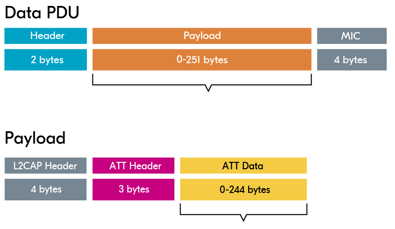
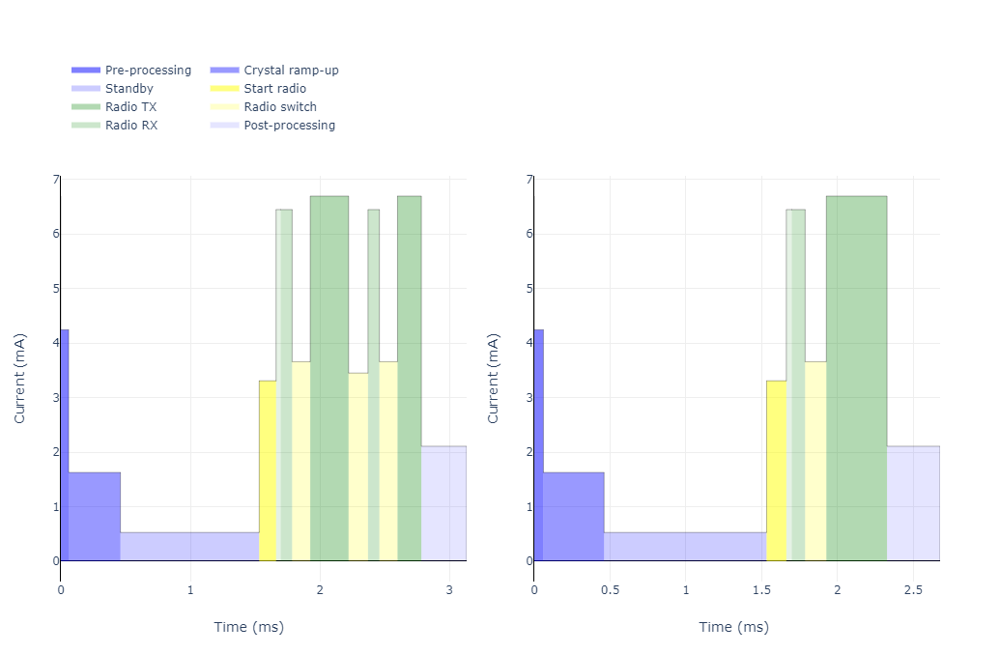

# Connection Parameters

When a peripheral and central device enter into a connection, there is a set of **connection parameters** that are exchanged.

Some of them have a **standard start value**, for backward compatibility, while some of them are dictated by the central device, and are included in the connection request packet.

The connection interval and the connection supervision timeout are **set by the central** in the connection request packet, in addition to the peripheral latency.

Peripheral latency allows the peripheral to **skip waking up** for connection events if it doesn’t have data to send.

The radio mode (1M, 2M, or coded PHY) is set to 1M by **default** for backward compatibility but can be changed during the connection.

The data length and MTU (Maximum Transfer Unit) are **also set** for backward compatibility.

### Connection Interval

In a connection, an agreement is reached on the connection interval that indicates **how often** devices will communicate with each other.

When they are done communicating, they will turn off the radio, set a timer, and go into **idle mode**, and when the timer times out, they will both wake up and communicate again.

The implementation of this is handled by the Bluetooth LE stack, but it is up to **your application** to decide how often you want the devices to communicate by setting the connection interval.

### Supervision Timeout

When two devices are connected, they agree on a parameter that determines **how long** it should take since the last packet was successfully received until the devices consider the connection lost.

If one of the devices is **unexpectedly switched off**, runs out of battery, or if the devices are out of radio range, then this is the amount of time it takes between successfully receiving the last packet before the connection is considered lost.

### Peripheral Latency

Peripheral latency allows the peripheral to **skip waking up** for a certain number of connection events if it doesn’t have any data to send.

Usually, the connection interval is a strict **tradeoff between** power consumption and low latency or delay in communication.

If you want to reduce the latency, but still keep a low power consumption, **you can use** peripheral latency.

This is particularly useful in HID (Human Interface Devices) applications, such as computer mouse and keyboard applications, which **usually don’t** have any data to send, but when it has data to send, we want to have very low latency.

Using the peripheral latency option, we can maintain **low latency** but reduce power consumption by remaining idle for several connection intervals.

### PHY Radio Mode

Normal Bluetooth LE transmits at 1Mbps. However, in Bluetooth 5.0, both high-speed and long-range radio modes were introduced. This gives us **two more options**.

First, we can increase the **modulation scheme** to use 2Mbps for higher transmit rates.

This either means that you can **transfer the data faster**, and go back to sleep faster to conserve more power, or you can use that extra time to send even more data, practically doubling the throughput of a Bluetooth LE connection.

This does however come with the cost of a slightly **shorter range**.

The other option is to use Coded PHY which results in a significant **increase in range**, but at the cost of lower throughput.

### Data Length and MTU

The data length and MTU (Maximum Transfer Unit) are **two different parameters**, but they often go hand in hand.

The MTU is the number of bytes that can be sent in **one GATT operation**, while the data length is the number of bytes that can be sent in one Bluetooth LE packet.

MTU has a **default value** of 23 bytes, and data length has a default value of 27 bytes.

When MTU is larger than the data length, the data will be **segmented into chunks** of the data length’s size.

This means that to your application it looks like a message is being sent, but over the air, the data is actually broken up into **smaller segments**.

In Bluetooth 4.2, Data Length Extension (DLE) was introduced to allow the data length to be **increased** from the default 27 bytes to up to 251 bytes.

Packing everything together also **reduces** the number of bytes you need to transmit over the air, as every packet includes a 3-byte header. This saves both time and power and in turn, allows for higher throughput in your Bluetooth LE connection.

The relation between data length and MTU **is not** one-to-one. On air, the data length can be up to 251 bytes, while the actual payload that you can send is a maximum of 244 bytes.

This is because the 251-byte Data PDU payload needs an L2CAP Header of 4 bytes and an Attribute header of 3 bytes. This leaves you with 251 – 4 – 3 = 244 bytes that you **can actually populate** with payload data.

<figure><figcaption>
Relation between MTU and Data Size
</figcaption></figure>

Below is a figure showing what it looks like to send a message with 40 bytes before and after changing the default data length. It is clear that **sending all the data** in one packet leads to less radio on time.

<figure><figcaption>
Left: 40-byte payload without data length extension. Right: 40-byte payload with data length extension. Source: <a href="https://devzone.nordicsemi.com/power/w/opp/2/online-power-profiler-for-bluetooth-le">Online Power Profiler tool</a>
</figcaption></figure>

### Updating the Connection Parameters

The connection interval, supervision timeout, and peripheral latency are **dictated by the central**, but the peripheral can request changes.

However, it is **always** the central that has the final say with these requests. So in the case where the central is your phone, it is the OS running on the phone that decides whether to accept or reject the new parameters in the connection parameter request.

As for the PHY radio mode, data length, and MTU, these cannot be chosen only by the central. Since the ability to change these parameters was introduced in later releases of the Bluetooth Specification, they are **always** set to their default values when a connection is first established.

When the connection is first established, **either device** can request to update these parameters with new values. The other device will then either send its supported values or state that it does not support updating one or more of those parameters.

Taking the data length as an **example**, this is always 27 bytes when the connection is first established. Then let’s say that the peripheral wants to update this to 200 bytes, and sends a request to do so.

The central may then **reply with a message** saying it can do 180 bytes, and then they will agree on having the data length set to 180 bytes.

The **default value** for the PHY radio mode is 1M, and the default MTU is 23.
