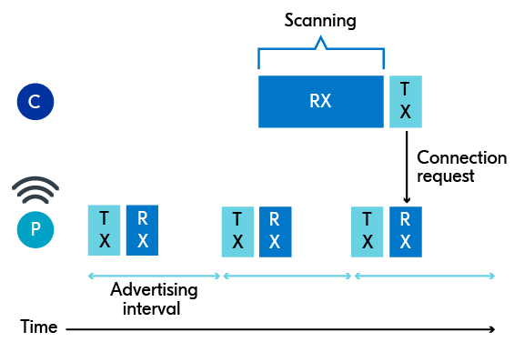
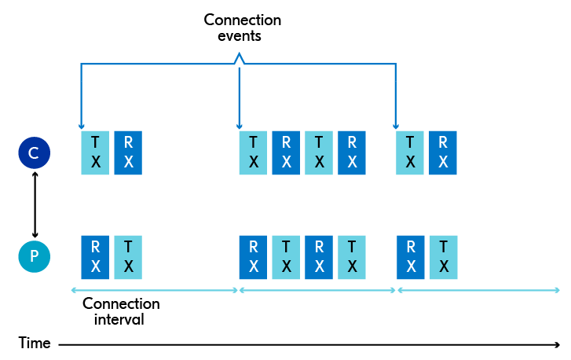

# Connection Process

### Connecting

Establishing a connection requires **two devices**, one acting as a peripheral that is currently advertising, and one acting as a central that is currently scanning.

When a central device picks up an **advertisement packet** from a peripheral device, it can initiate a connection.

Usually, this involves **scanning** the contents of the advertisement packet, and then deciding whether or not to initiate a connection based on that.

When the central sends a **connection request**, the peripheral and central have established a bi-directional connection (connection-oriented) channel.

<figure><figcaption>
Connecting example
</figcaption></figure>

As we can see in the figure above, a peripheral that is sending out advertisements that are connectable will always have a **short RX window** after every advertisement, which is used to listen to incoming connection requests.

We call it a **connection request**, but in reality, the peripheral can’t choose whether to accept or reject the connection request.

It has to **always accept** the connection request unless it is using an accept list filter.

Later, at any point in time, it may choose to **disconnect** from the central if it doesn’t want to stay connected.


Using an accept list filter, formerly known as whitelisting, is a way the peripheral can limit which devices are allowed to send it a connection request.


### During the connection

After the peripheral **successfully** receives the connection request packet, the two devices are in a connection.

When a connection is entered, the devices will **no longer use** the advertising channels (channels 37, 38, and 39), but start using the data channels (channels 0 to 36).

To reduce interference and improve throughput during a connection, Bluetooth LE uses **channel hopping**, meaning the channel used for data transmission is changed frequently.

This way, if they are located in an environment that has a lot of noise on some channels, the messages will be **retransmitted** to another channel in the next connection interval.

To ensure data integrity, all packets transmitted over Bluetooth LE will be **retried infinitely** until an acknowledgment is received or the connection is terminated.

The nature of a Bluetooth LE connection is a main factor in how the devices achieve such **low power** consumption. In a connection, both devices spend most of their time sleeping.

To accomplish this, they agree on **how often** they will wake up to talk. Otherwise, they turn off the radio, set a timer, and go to sleep.

The time they agree on sleeping is known as the **connection interval** and is set in the initial connection, while the connection event occurs every connection interval when they wake up to talk.

* **Connection interval:** The interval at which two devices in a connection wake up to exchange data.
* **Connection event:** Occurs every connection interval, when the central sends a packet to the peripheral

The following figure shows what a typical connection looks like. Both the central and the peripheral **wake up** every connection interval for the connection events and transmitting data.

<figure><figcaption>
Typical connection example
</figcaption></figure>

The connection interval is initially **set by the central** in the connection request packet, but it can be changed later in the connection.

The two devices can send many packets every connection interval if they need to send a lot of data, but when they stop sending data, they have to **wait** for the next connection event to send more data.

Even if there is no useful data to send, the peers need to send **empty packets** to sync their clocks. If you want to send more data than there is time for in one connection interval, it will be split over several connection intervals.

### Disconnecting

When two devices are connected, they will remain connected **forever** if nothing happens. There are two ways that a connection can be terminated, meaning the devices disconnect:

* Disconnected by **application**
* Disconnected by **supervision timeout**

#### **Disconnected by application**

If either of the devices want to, they can send a **termination packet** that will disconnect the device.

This can, for example, be done because a device **no longer wishes** to be connected to the other device, but it will also happen if there is something wrong with the connection.

#### Disconnected by supervision timeout

If a device **stops responding** to packets, the connection is terminated.

There can be **several** reasons for this.

* The application on the connected device crashed and reset.
* The connected device ran out of battery.
* The connected device was taken out of radio range.
