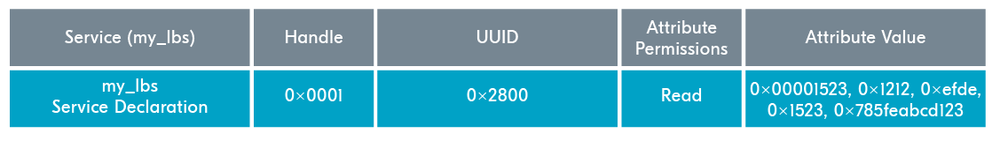

# Attribute Table

To best visualize how attributes are stored in a GATT server, let’s examine an **example** attribute table.

<figure><figcaption>
my_lbs attribute table
</figcaption></figure>

This attribute table depicts a **custom service** called “my\_lbs”. The my\_lbs service holds three characteristics:

* Button Characteristic
* LED Characteristic
* MySensor Characteristic

### Service Declaration

The first line in the table declares this service with a **service declaration** attribute.

The Type field in a **declaration attribute** holds a unique SIG-defined value, and for service declarations, the UUID is 0x2800.

There is **no reason to write** to a declaration attribute, therefore its permissions are always Read-only.

Lastly, the value field of the service declaration attribute holds the **UUID of the service** it’s declaring.

<figure><figcaption>
Service Declaration
</figcaption></figure>

### Button Characteristic

The Button characteristic is defined first. The Button characteristic is first declared with the Button **Characteristic Declaration**.

The Type field of a characteristic declaration attribute is **always** 0x2803 to declare a characteristic and the permissions are always Read-only.

The Value field holds the **handle** of the value attribute, properties, and the UUID of the characteristic it’s declaring.

Then comes the button characteristic value attribute which holds the actual user data, in this case, whether the **button is pushed or not**.

Lastly, since the button characteristic supports the **Indicate operation**, there is a CCCD to enable indications for the Button characteristic.

The CCCD will always have the UUID `0x2902` and the permission to **Read and write**.

In this specific table, we can see that the **Indicate bit-field** has been enabled. Notice that the CCCD isn’t referenced in the characteristic declaration like the value declaration is, but can be recognized by the distinct UUID.

<figure><figcaption>
Button characteristic definition
</figcaption></figure>

### LED Characteristic

After this comes the LED characteristic, which is very similar to the button characteristic. Notice that this characteristic only **supports the** **Write operation**, and therefore does not have a CCCD. It has only 2 characteristics, declaration and value.

<figure><figcaption>
LED characteristic definition
</figcaption></figure>

### MySensor Characteristic

Lastly, the definition of the MySensor characteristic, which only supports the **Notify operation**. Notice how the bitfield for the Notify operation has been enabled in the CCCD of the MySensor characteristic.

<figure><figcaption>
MySensor characteristic definition
</figcaption></figure>
