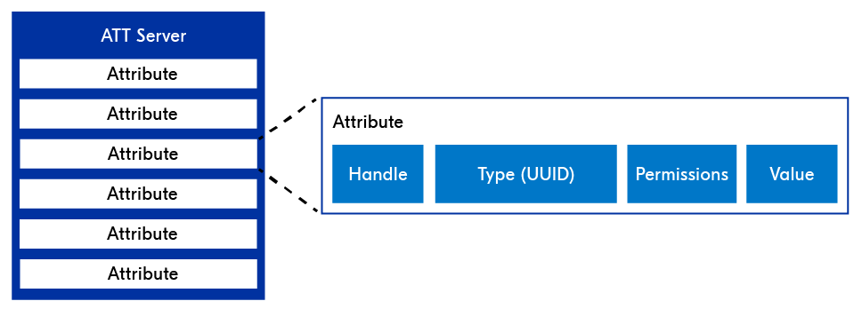
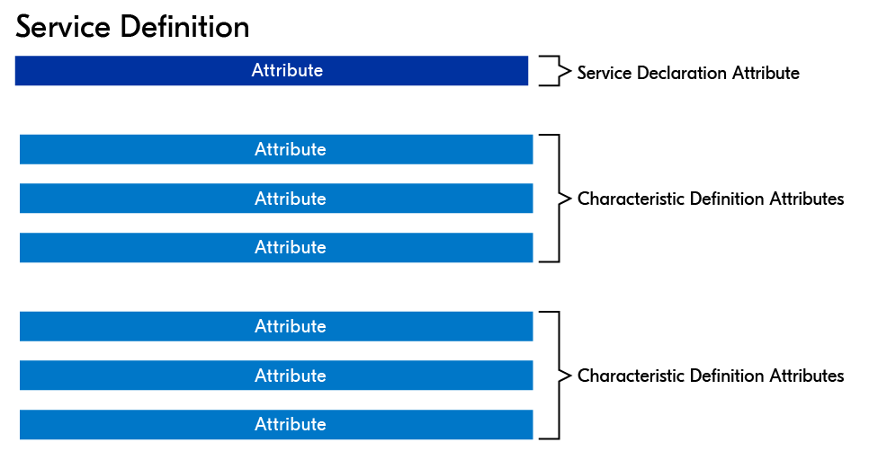
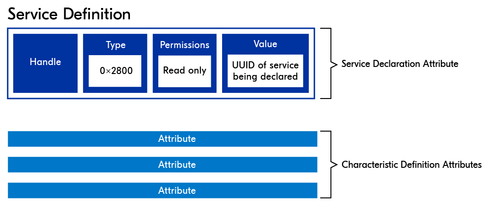
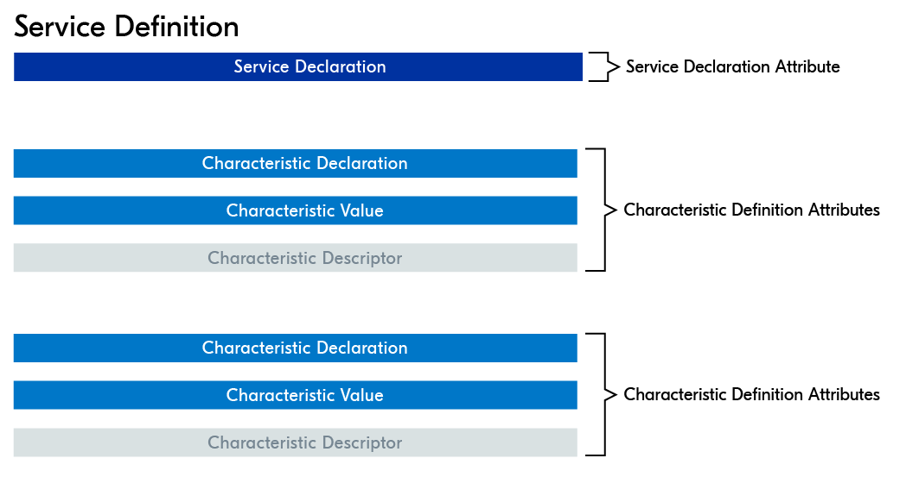
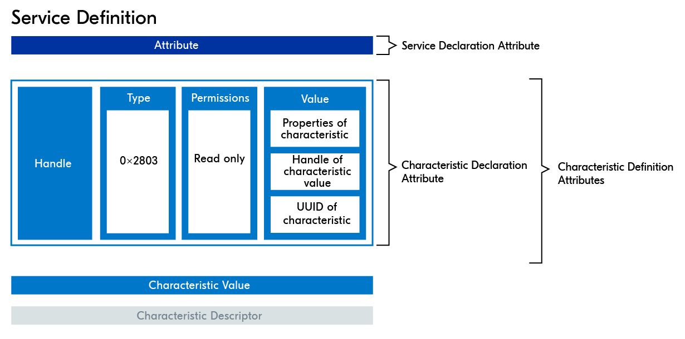
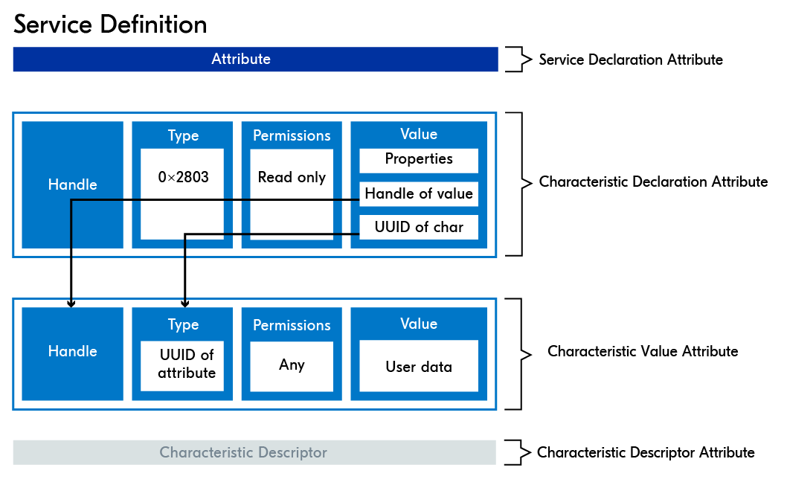
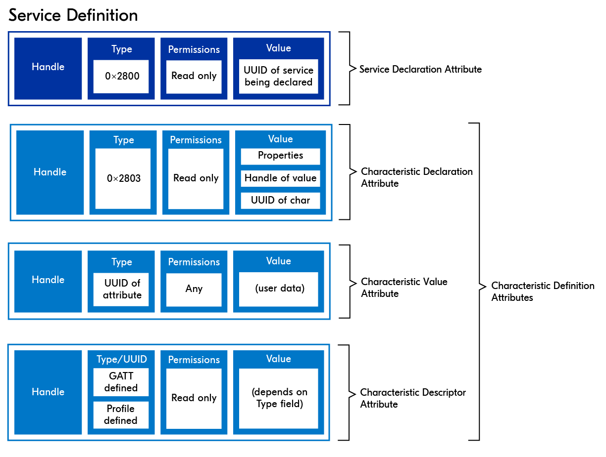
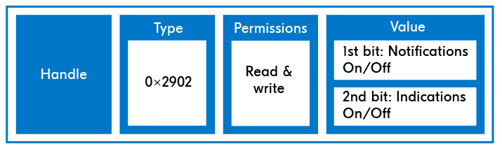

# Services and Characteristics

One of the main functions of GATT is the hierarchal structuring of attributes stored in a GATT server into **standardized entities** (services and characteristics) providing seamless interoperability between different Bluetooth LE devices.

## Attributes

The ATT layer defines how data is **stored and accessed** in a server’s database. The data is stored in the form of data structures called Attributes.

Attributes are the **core units** of data on which the ATT and GATT layers are based. They hold user data as well as metadata describing the attribute itself, its type, security permissions, etc.

**Data exchange** occurring between ATT servers and clients, or, GATT servers and clients, is in the form of attributes.

When discussing just attributes, they are said to be stored on an ATT server. When we started **classifying attributes** into services and characteristics, we referred to this data structure as the GATT server.

An attribute consists of **4 blocks** of data:

<figure><figcaption>
Data stored in an ATT server as attributes
</figcaption></figure>

* **Handle**: A 16-bit unique index to a specific attribute in the attribute table, assigned by the stack. An attribute is addressed via its handle. You can think of it as the row number in the attribute table, although handles are not necessarily sequential.
* **Type (UUID)**: Universally unique ID (UUID), which tells us the attribute type. For example, if this attribute declares a characteristic, this will be reflected in its **Type** field as it will hold a UUID used specifically to indicate declaring a characteristic.
* **Permissions**: The security level required (encryption and/or authorization) to handle that attribute, in addition to indicating whether it’s a readable and/or writeable attribute.
* **Value**:
  * The actual user data that is stored in the attribute. This field accepts any data type.
  * It can also hold information about another attribute.

### Universally Unique ID (UUID)

It is a unique number used to identify attributes and tells us about their significance. UUIDs have **two types**.

* SIG-defined 16-bit UUID.
* 128-bit UUID, sometimes referred to as a vendor-specific UUID.

## Services

As shown in the below figure, attributes are the main building blocks for services. A service definition (commonly referred to as a service) is comprised of **multiple attributes arranged** in a GATT-specified format which facilitates standardized data exchange between Bluetooth LE devices.

<figure><figcaption>
Attributes forming a service with two characteristics
</figcaption></figure>

### Service Declaration Attribute

Service definitions **always** start with a service declaration attribute. This attribute holds metadata about the service, it also indicates the beginning of a service in the sequence of services stored on a GATT server.

<figure><figcaption>
Service declaration attribute
</figcaption></figure>

The **Handle** is similar to a row number by which the attribute is addressed. The service declaration attribute’s **Type** field holds the UUID (`0x2800`) which is a unique SIG-defined UUID used only to indicate the beginning of a service.

The **Permissions** field here indicates “read-only” and no authentication is needed.

Lastly, the **Value** field holds the UUID of the service being declared.

## Characteristics

Subsequently, a service can have zero or more characteristic definitions. A characteristic is comprised of at least two attributes and optionally more.

<figure><figcaption>
Attributes forming a characteristic
</figcaption></figure>

Similar to a service definition, a **characteristic definition** starts with a declaration attribute, to indicate the beginning of a characteristic in the sequence of characteristics in a service definition.

This is followed by the **characteristic value** attribute which holds the actual user data.

Optionally, a characteristic can also have one or more **characteristic descriptor** attributes.

* **Characteristic declaration attribute**: Holds metadata about the Characteristic Value Attribute.
* **Characteristic value attribute**: Holds the actual user data.
* **Characteristic descriptor attribute** (optional): Holds more metadata about the characteristic.

### Characteristic Declaration Attribute

A characteristic definition starts with a **characteristic declaration** attribute, to indicate the beginning of a characteristic in the sequence of characteristics in a service definition.

The characteristic declaration attribute’s Type field **holds the UUID** (`0x2803`) used only to declare a characteristic.

The declaration attribute has **read-only Permissions**, ensuring that clients can read the value but not write to it.

<figure><figcaption>
Characteristic declaration attribute
</figcaption></figure>

The **Value** field holds important information about the characteristic being declared, specifically three separate fields:

* **Characteristic properties**: What kind of GATT operations are permitted on this characteristic?
* **Characteristic value handle**: The handle (address) of the attribute that contains the user data (value).
* **Characteristic UUID**: The UUID of the characteristic being declared.

### Characteristic Value Attribute

After the attribute declaring the characteristic comes the **characteristic value** attribute. This is where the actual user data is stored.

Its **Handle** and **Type** are the ones referred to in the Characteristic Declaration Attribute **Value** field.

Naturally, its **Value** field is where the actual user data is stored. The **Permissions** field indicates whether the client can read and/or write to this attribute.

<figure><figcaption>
Characteristic value attribute
</figcaption></figure>

### Characteristic Descriptors

The characteristic descriptor attributes are **optional**.

They hold additional metadata about the characteristic, giving the client more information about the **nature of the characteristic**.

There are several kinds of descriptors, but they are generally divided into **two categories**, GATT-defined and custom.

<figure><figcaption>
Characteristic descriptor
</figcaption></figure>

Descriptors also allow the client to set permissions for **certain server-initiated** GATT operations.

### Client Characteristic Configuration Descriptor (CCCD)

The Client characteristic configuration descriptor (CCCD) is a specific type of **characteristic descriptor** that is necessary when the characteristic supports server-initiated operations (Notify and Indicate).

This is a writable descriptor that allows the GATT client to **enable and disable** notifications or indications for that characteristic.

The GATT client can **subscribe to the characteristic** that it wishes to receive updates about, by enabling either Indications or Notifications in the CCCD of that specific characteristic.

The CCCD attribute’s format is as pictured below. The UUID for CCCDs is `0x2902`. A CCCD must **always** be readable and writable.

Descriptors with the **Type** CCCD only have 2 bits in their **Value** field. The first bit signals whether Notifications are enabled, and the second bit is for Indications.

<figure><figcaption>
Client characteristic configuration descriptor
</figcaption></figure>
