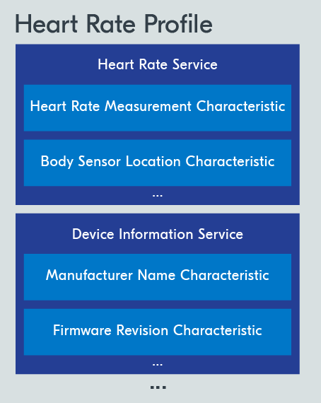

# ATT & GATT

After establishing a connection, there is a need for **bidirectional data exchange**. This requires specific data structures and protocols tailored for these purposes.

The Attribute protocol (ATT) layer, and the Generic Attribute protocol (GATT) layer right above it, define how data is **represented and exchanged** between Bluetooth LE devices.

### The Attribute Protocol

The ATT layer is the basis on which data is transmitted, received, and handled in the **connection phase** of Bluetooth LE devices. It is based on a client-server architecture.

The client and server roles defined in this layer are assigned **independently** from the peripheral and central roles defined in the GAP layer.

In most cases, the peripheral will be a server since the peripheral is the device that **acquires** data and holds it.

* **GATT server:** A device that stores data and provides methods for the GATT client to access the data.
* **GATT client:** A device that accesses the data on the GATT server, through specific GATT operations.

The ATT layer defines a data structure called the **attribute**, which is used by the GATT server to store data. The server can hold a number of different attributes at the same time.

* **Attribute**: A standardized data representation format defined by the ATT protocol

### The Generic Attribute Profile

The Generic Attribute Profile (GATT) layer sits **directly** on top of the ATT layer and builds on it by hierarchically classifying attributes into profiles, services, and characteristics.

#### Profiles, services, and characteristics

Two attributes together form what’s called a _**characteristic**_. All characteristics are enclosed in what’s called a _**service**_. Services usually contain multiple characteristics.

<figure><figcaption>
Example of the Heart Rate profile
</figcaption></figure>

Before a client starts interacting with a server, the client is **not aware** of the nature of the attributes stored on that server. Therefore, the client first performs what’s called Service Discovery where it inquires from the server about the attributes.


The complete list of GATT profiles defined by the Bluetooth SIG can be found [here](https://www.bluetooth.com/specifications/specs/). The Bluetooth specification also allows vendors to define their own profiles for use cases not covered by the SIG-defined profiles.

