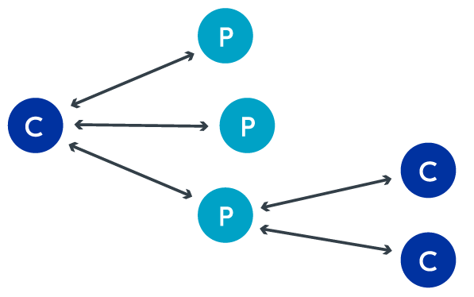
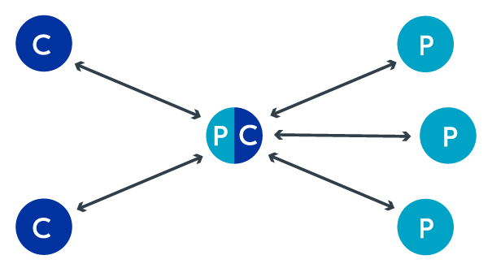
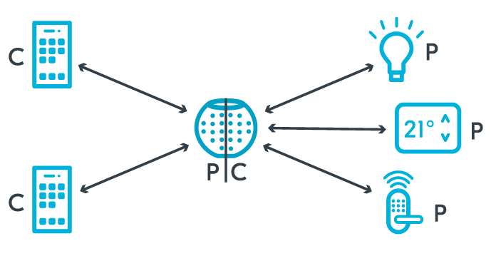

# GAP

The Bluetooth LE protocol supports **two different** communication styles: connection-oriented communication and broadcast communication.

* **Connection-oriented communication**: When there is a dedicated connection between devices, forming bi-directional communication.
* **Broadcast communication**: When devices communicate without establishing a connection first, by broadcasting data packets to all devices within range.

### Device Roles

The GAP layer **defines device roles** for nodes in a Bluetooth LE network. These roles determine important aspects such as how the device advertises its presence, or how it scans and connects to other nodes.

* **Advertising:** The process of transmitting advertising packets, either just to broadcast data or to be discovered by another device.
* **Scanning:** The process of listening for advertising packets.

#### Central and peripheral

The device that **scans** for advertisements is the central.

If the peripheral’s advertisement packets are **scanned** by the central, the central can initiate a connection by sending a connection request to the peripheral.

The peripheral and the central **establish** a connection.

* **Central**: A device role that scans and initiates connections with peripherals.
* **Peripheral**: A device role that advertises and accepts connections from centrals.

The central device can send connection requests to **more than one** peripheral simultaneously.

Peripherals can also accept connection requests **from other centrals** by restarting the advertising process after a connection has been established.

Since the central acts as the host, it is responsible for typical host-role duties such as connection management and data processing. This means peripherals generally **use less power** than a central.

IoT devices that are resource-constrained and require **low power** are usually the peripheral devices in a Bluetooth LE connection. In contrast, the central device is something like a mobile phone, which has more power.

#### Broadcaster and observer

Sometimes devices only wish to broadcast information **without** being in a connection with another device.

A very good example of broadcasters is **beacon devices**. They only transmit information, without the need to connect to a specific device.

* **Broadcaster:** A special kind of peripheral that broadcasts advertisement packets without accepting any connection requests.
* **Observer:** A special kind of central that listens to advertising packets without initiating a connection.

### Network Topologies

How the device roles are used in the **different** network topologies possible with Bluetooth LE.

#### Broadcast topology

In a broadcast topology, data transfer happens **without** the devices ever establishing a connection.

This is done by using the **advertisement packets** to broadcast the data to any device that is in range to receive the packets.

A peripheral (broadcaster) advertises the data, and the central (observer) will **scan and read** the data from the advertisement packets.

<figure><figcaption>
An example of a broadcast topology
</figcaption></figure>

There is **no limit** to how many devices one can broadcast. Anyone in range of the advertisement packets can receive the information.

#### Connected Topology

A connected network topology **establishes a connection** before data transfer occurs.


Although the Bluetooth LE specification technically does **not limit** the number of connections possible, there are bandwidth and hardware limitations that come with using small embedded devices


<figure><figcaption>
An example of a connected topology
</figcaption></figure>

The advantage of a connected topology is the **increased throughput** that comes with establishing a direct link before communication.

The communication is **bi-directional**, meaning that the central and peripheral can communicate with each other.

> With the introduction of Periodic Advertising with Responses (PAwR) in Bluetooth 5.4, bidirectional communication in connectionless mode is **possible**.

#### Multi-role Topology

A single device can also operate in **multiple different roles** simultaneously. For instance, the same device can act as a peripheral in one setting and a central in another.

<figure><figcaption>
Example of a multi-role topology
</figcaption></figure>

This multi-role functionality is often used in systems where a device, is receiving sensor data from multiple sensors, **but also** wants to forward this data to mobile phones.

In this case, the device can act as a central and connect to multiple sensors (peripherals), **and can also** act as a peripheral and transmit sensor data to one or more smartphones (centrals).

<figure><figcaption>
Example use-case for multi-role topology
</figcaption></figure>
