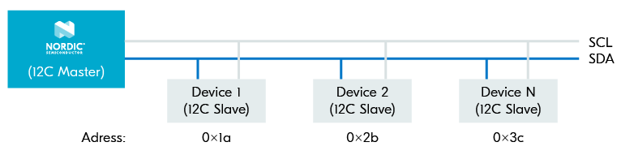

# I2C

I2C is a widely used 2-wire synchronous serial communication protocol. It is commonly used to **interface a microcontroller** to all sorts of sensors and ICs, including other microcontrollers. Since it uses 2-wire, the I2C protocol is also known as the Two-Wire Interface (TWI).

As the name suggests, it is aimed at interconnection over short distances and generally within a device’s PCB that can operate in **two roles**: as a “master” that initiates transactions and controls the clock, or as a “slave” that responds to transaction commands.

The two I2C wires are called serial clock (SCL) and serial data (SDA). All devices on the bus are connected to **these two lines**, as shown in the figure below.

<figure><figcaption>
I2C wires
</figcaption></figure>

The SCL is generated by the I2C master to sync all devices on the bus to one clock, while the SDA line is bidirectional, so data can travel in **either direction** (from master to slave or slave to master).

Each I2C slave device has a unique address that **distinguishes** it from the other I2C slave devices on the same bus. The address is usually a 7-bit value, however, some I2C slave devices also use a 10-bit value.

\
