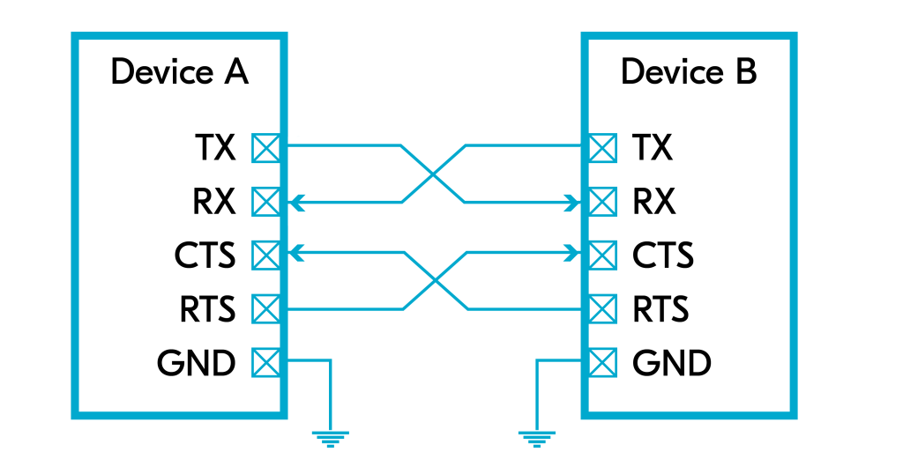

# UART

UART is a peer-to-peer (P2P) hardware **communication protocol** where one end can be an MCU (microcontroller) and the other end can be another MCU, a sensor, or a PC (through a USB-to-UART converter).

Data transfer is done serially. It starts with a **starting bit**, usually by driving a logic low for one clock cycle. In the next n clock cycles, n bits are sent sequentially from the transmitter (n is usually 8).

Optionally, 1 parity bit can be added to **improve transfer reliability**. In the end, the data wire is usually pulled up high to indicate the end of the transfer.

* **Parity bit:** A parity bit describes the evenness or oddness of the data and is a way for the receiver to tell if the data has changed during transmission.

<figure><figcaption>
UART timing diagram Source: <a href="https://en.wikipedia.org/wiki/Universal_asynchronous_receiver-transmitter">Wikipedia</a>
</figcaption></figure>

UART has one connection pin for transmitted data, usually called TX, and another for received data, called RX. These connections are **cross-coupled** between a transmitter and a receiver. So the TX on one device is connected to the RX on the remote device and vice versa. GND stands for ground.

<figure><figcaption>
UART connection
</figcaption></figure>

The RX pin senses when a start bit has been initiated and automatically clocks in to store the new word. The data rate that the receiver and transmitter will operate at must be selected in advance; this is known as the **baud rate**. Common baud rate values for UART are 115200 or 9600 bits/s, or bauds.

It is also possible to use **hardware flow control** with UART using two extra lines called RTS (request to send) and CTS (clear to send).

<figure><figcaption>
UART connection with hardware flow control
</figcaption></figure>

These wires are cross-coupled between the two devices. If hardware flow control **is enabled**, each end will use its RTS to indicate that it is ready to send new data and read its CTS to see if it is allowed to send data to the other end.
