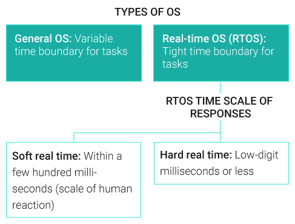

# RTOS

## What is a Real-time Operating System?

A real-time operating system (RTOS) is an operating system with two key features: **predictability and determinism**.

In an RTOS, repeated tasks are performed within a **tight time boundary**, while in a general-purpose operating system, this is not necessarily so.

Predictability and determinism, in this case, go hand in hand: **We know** how long a task will take, and that it will always produce the same result.

RTOSes are **subdivided** into “soft” real-time and “hard” real-time systems.

* **Soft real-time systems** operate within a few hundred milliseconds, at the scale of a human reaction.
* **Hard real-time systems** provide responses that are predictable within tens of milliseconds or less.

<figure><figcaption>
Taxonomy of operating systems
</figcaption></figure>

### RTOS vs. OS

An RTOS is a type of operating system, but it is **vastly different** from the kind most consumers are familiar with.

Operating systems in phones or personal computers are bloated with apps and features; **they must** be able to support anything the user might want to do today.

An RTOS, on the other hand, is **simplified and designed** to execute its tasks quickly and effectively.

It is a **fraction of the size**, sometimes only a few megabytes, with a simple graphical interface, and it lacks many familiar features, such as a web browser.

## Real-Time System Characteristics

### **5 Characteristics of an RTOS**

* **Determinism:** Repeating an input will result in the same output.
* **High performance:** Fast and responsive, often executing actions in a small fraction of the time required for a general operating system.
* **Safety and security:** Frequently used in critical systems when failures can have catastrophic consequences, such as robotics or flight controllers. To protect those around them, they must have higher security standards and more reliable safety features.
* **Priority-based scheduling:** Actions assigned with high priority are executed first and those with lower priority come later. This means that an RTOS will always perform the most important task.
* **Small footprint:** Versus their hefty general OS counterparts, RTOSes weigh in at just a fraction of the size.

### RTOS vs. Embedded System

An embedded system is a computer that is embedded into a larger machine, for example, the **microcontroller** on a robotic arm.

In non-critical systems with some timeline flexibility, **developers can use** an open-source general-purpose OS (GPOS) such as Linux.

Linux is full-featured, flexible, and well-known. In a **critical system** (whether that means safety-critical or mission-critical), developers opt for real-time operating systems.

The **characteristics** that set an RTOS apart are often essential to success.

For instance, a robotic arm in a factory needs to be **predictable and reliable**, and it must be able to stop immediately when employees enter its area of operation.

**Variability can result** in wasted resources, quality-control issues, or injury.

#### RTOS Use in Embedded Systems

Due to its benefits, a real-time operating system is most often used in an **embedded system**, which is a system that operates behind the scenes of a larger operation.

The RTOS usually has **no graphical interface**. Occasionally, multiple OSes are integrated simultaneously, to provide operational capability coupled with the usability of a general-purpose OS.

RTOSes are often in **intelligent edge devices**, also known as electromechanical edge or cyber-physical systems. This means that the device is both producing and operating upon data.

So a car, for example, would be able to **monitor its surroundings** and act upon them instantaneously on its own.

These devices often combine artificial intelligence with real-time components to **enhance the capabilities** of the underlying structure.

### Features and Advantages of an RTOS

An RTOS is small, fast, responsive, and deterministic. This means that it will execute tasks **quickly and efficiently**, responding as expected every time.

Due to the significance of its host device, the RTOS infrastructure is more secure and **less likely** to crash or fail.

Finally, an RTOS is developer-oriented, meaning that it continues to roll out updates that help users **code more effectively**.

#### Commercial vs. In-House RTOS

Some companies try to produce their **own RTOS** in-house, tailor-made for their project, instead of buying a commercial off-the-shelf operating system.

This has some advantages: The operating system is designed **specifically for the use case**, and the company understands its mechanics and inner workings.

However, this approach is often **more expensive and more time-consuming**, and developers who are not used to working on operating systems take a great deal of time to produce one.

Using a commercial system is faster, and easier, and brings the benefit of an **experienced technical team** that can answer questions and provide support.

### Why use an RTOS?

In applications that require **reliable and repeatable** actions, the RTOS is favored over its general OS counterpart.

Especially in **embedded or critical systems**, where reliability and speed are essential, a real-time operating system is needed.

## Disciplines That Impact RTOS

The RTOS industry is **heavily influenced** by developments in the computer hardware industry.

When new developments, such as the use of multi-core technology, become common, OSes are **updated to support** them.

Emerging technologies such as artificial intelligence, machine learning, and 5G are also under the scrutiny of the OS developer since a changing industry means **systems must support** an array of use cases.

OS architects must **consider trends** in software as well as hardware development.

As the field changes and developer profiles pivot, updates **must support** new languages, new technologies, and new deployments.

## RTOS Architectures

Aside from the minute details, **two prevailing design** philosophies affect RTOS design: monolithic kernel versus microkernel.

These systems are differentiated by **their structure**; whereas monolithic kernel systems run in a single space, microkernel systems compartmentalize different components of the architecture.

### Microkernel Systems

In microkernel architecture, components are stored in separate “rooms,” which are **independent of each other** but share a similar space.

A room can be renovated without impacting those around it. However, to get from one to another, you have to **step through the doorway** and head down the hall, which wastes time.

Any action has to return to the kernel before it can move to the component it references, meaning some operations take **much longer than necessary**.

### Monolithic Systems

In a monolithic system, there are no “walls” between the rooms, so you can step from one to another **much more quickly**.&#x20;

Rather than implementing a small kernel, monolithic kernels provide **services of their own** as well as regulate those of other areas.

With exceptions, operations are executed in the kernel space, removing the recurrent need to return to the kernel and **improving speed and performance**.

However, making a change in one area could have ramifications for the **entire system**.

| Microkernel System                                                                                            | Monolithic System                                                                                                                 |
| ------------------------------------------------------------------------------------------------------------- | --------------------------------------------------------------------------------------------------------------------------------- |
| The kernel and operations are housed in **separate spaces**, with the kernel itself being bare (hence micro). | Kernel and operation processes share the same space. Operations move **more quickly**, and the systems boast higher performance.  |
| Operation spaces are **not given access** to one another and must return to the kernel.                       | However, updates may require an **extensive overhaul**.                                                                           |

## Real-Time System Examples

RTOSes can be found in countless products around the world. Systems from car engines to deep-space telescopes to helicopter guidance systems to the Mars rovers use embedded systems that run a real-time operating system.

* **A\&D**
  * Flight display controller
  * Engine Turbine
  * Drones
  * Extraterrestrial rovers
* **Telecom**
  * 5G Modem
  * Satellite modem
  * Base station
* **Transportation**
  * Functional safety systems
  * Emergency braking systems
  * Engine warning  systems
* **Medical**
  * Magnetic resonance imaging
  * Surgery equipment
  * Ventilators
* **Manufacturing**
  * Factory robotics systems
  * Safety systems
  * Oil and gas vibration monitors

## The Changing World of Embedded and RTOS

### New Methodologies

Expectations for embedded systems cascade down to the operating systems that power them. Real-time operating systems must **keep pace with innovation** and embrace modern development practices.

This means being compatible with the frameworks, languages, and methodologies embraced by the **new generation** of embedded system developers while allowing no compromise in terms of security, safety, performance, or reliability.

### Supporting Legacy Systems

Innovative advancements increasing performance, connectivity, and design cycles are starting to make even **new products obsolete**. This raises the question of how to handle legacy systems.

It’s not financially viable to keep recording embedded applications. System makers, on the other hand, would prefer to use **existing code** as much as possible, especially when investment has already been made to certify software.

### New Hardware and Virtualization

Advances in multi-core–based hardware platforms have enabled the **consolidation** of embedded systems and applications.

With a single chip now able to contain any number from 2 to 64 CPUs, it is possible to **reduce** the cost, size, and weight of the final shipped product.

Virtualization is also **accelerating the development** of embedded systems. Multiple embedded systems can now run, in virtualized form, on a hypervisor on top of a single piece of hardware.

This is critical for manufacturers who want to **maximize their investment** in existing IP while providing a bridge from legacy applications to new platforms.

## Factors for Choosing a Commercial RTOS

### The Benefits of a Commercial RTOS vs. Open Source

Aside from in-house RTOS options, **developers can choose** to use open-source or community-based operating systems.

While these provide some of the **benefits** of a real-time operating system, they fall short in other key areas.

Larger deployments often make use of boards costing hundreds, thousands, or even millions of dollars, which means **developers are investing heavily** in hardware.

Problems encountered while implementing an open-source system could quickly push **deadlines and stretch budgets**.

Open-source systems also **lack organized** backing, which can result in missing documentation or unresolved glitches.

A commercial system, on the other hand, comes with the benefits of an organized, professional engineering team that will **help solve issues** or provide explanations.

### Common Business Challenges

* Leveraging the **massive growth** opportunity of IoT as soon as possible
* Differentiating product offerings with **leading-edge** features and capabilities
* Adding **new features to products** as market needs evolve while leveraging the investment in the core operating system, all while minimizing risks to devices already deployed in the field
* Keeping **platform costs down**
* Reducing time-to-market and **development risks** for deploying real-time systems
* **Efficiently** dividing engineering resources between sustaining existing products and developing new ones
* **Reducing risk** for platforms requiring real-time safe and secure capability at medium to high levels of certification
* Managing increasing **complexity** across multiple technologies, product lines, development organizations, and geographies

### Need for Safety Certification

If there is a need for **safety certification**, leveraging a commercial RTOS can make it easier and more cost-effective to achieve while reducing schedule risk.

In an evaluation for safety certification, the commercial RTOS must provide certification evidence pages or **safety profiles** for the specific certification your business requires.

### Hardware Support

Commercial RTOSes have an extensive range of **board support packages** (BSPs) to assist with board bring-up and design. These software kits make it quick and easy to use an RTOS with specific types of hardware.

#### Commercial RTOS Costs

While the cost of a commercial RTOS may be a **big objection**, one must also consider its overall benefits.

These could be **competitive advantage**, time-to-market, cost savings, risk reduction, and peace of mind.

It is important to develop and test the business value to determine whether these benefits **outweigh the cost**.

#### Paying Royalties for a Commercial RTOS

When considering a commercial RTOS, investigate the option of **royalty payments** through a production license (PL) model vs. an up-front charge.

The PL model is shared risk in that it helps create a **financial incentive** to make your business successful. Your business needs, cost structure, and budget can all impact your decision.

#### Compatibility and Support for Newer Versions

Long-term performance, security, and feature support are also factors in selecting a **commercial RTOS**. Some example areas to check include preserved API compatibility and POSIX® compliance.

Learning how much the core OS kernel is **expected to change** in the near future can help you predict how much effort will be required to upgrade or roll back versions.

There could also be **migration** considerations around networking and BSPs, and it is critical that the chosen option has the documentation and expert support necessary for your success.
